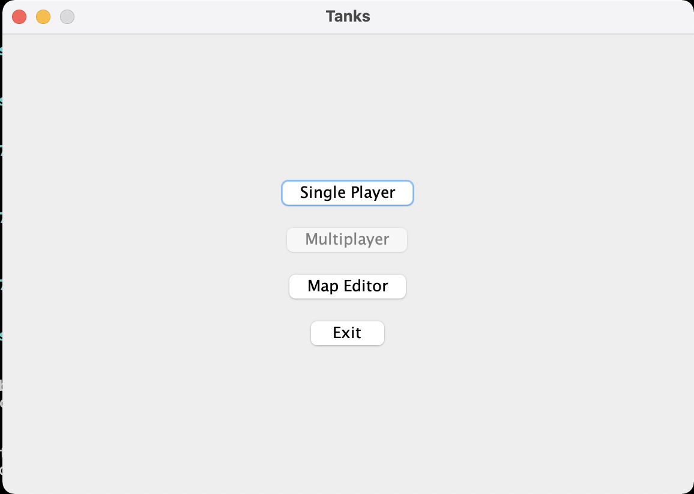
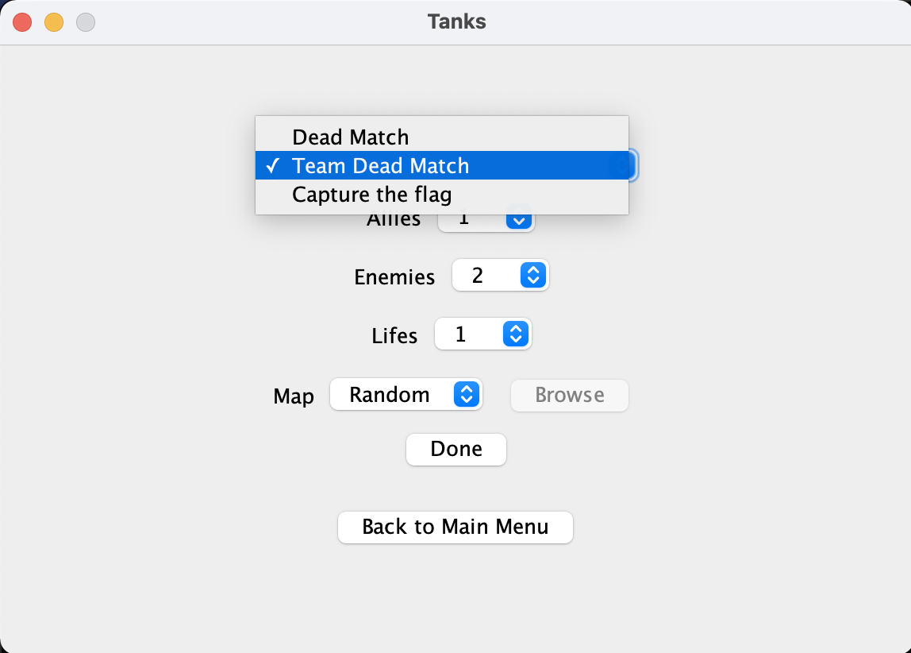
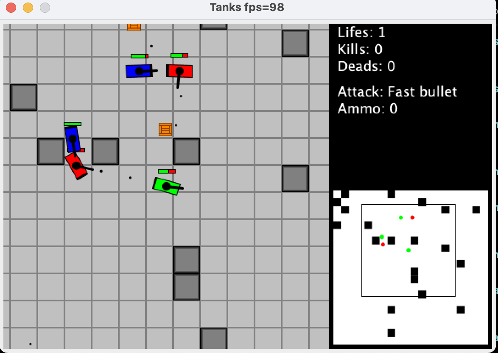

# Tanks

This was my project for Object Oriented Programming, class I took in the second semester of 2013.

I developed this game myself, but back then I didn't know git. So I created this repo many years later and added a README.md

## How to run it?

```
cd /src
./compile.sh
./run.sh
```

## Screenshots

Main menu:



Single player menu:



Team Deathmatch:



Capture the flag:


Map Editor:


